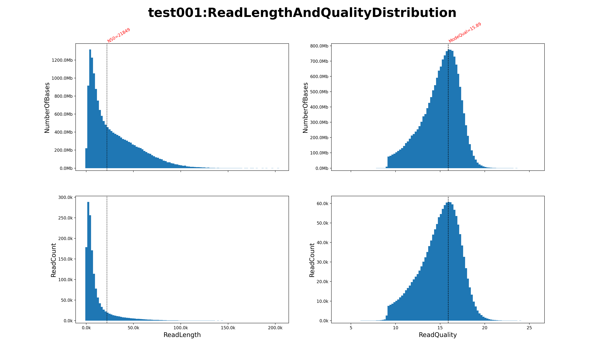

# nanofq

A simple Rust program designed for processing nanopore long reads, providing functionalities such as statistics generation, filtering, and adapter trimming.

## Installation

To get started with `nanofq`, follow the steps below. Ensure you have Cargo version 1.85.0 or higher installed.

```bash
git clone https://github.com/aadali/nanofq
cd nanofq
cargo build --release 
```
> Note: For generating statistical plots, `python3` along with the `matplotlib` library is required.

## usage

```
$ ./nanofq --help
A simple program for nanopore fastq file to stats, filter, trim...

Usage: nanofq [COMMAND]

Commands:
  stats   stats nanopore fastq, output the stats result, summary and figures
  filter  filter nanopore fastq by length, quality or gc content
  trim    trim adapter, barcode, primer that artificial sequence in nanopore fastq
  help    Print this message or the help of the given subcommand(s)

Options:
  -h, --help     Print help
  -V, --version  Print version
```
### Input Parameters
For all subcommand, there are three possible input scenarios:

1) **Standard Input(stdin)**
2) **Single Fastq File** - A text-based fastq or gzipped fastq ending with `.fq`, `.fastq`, `.fastq.gz` or `.fq.gz`
3) **Directory of Fastq Files** - A folder containing one or more fastq files (text-based or gzipped). The program will only process files matching the specified extensions

### Output
The output can be directed to either standard output (stdout) or a specific file path. Gzipped output is not supported.

### stats

```
stats nanopore fastq, output the stats result, summary and figures

Usage: nanofq stats [OPTIONS]

Options:
  -i, --input <input>        The input fastq, may be a single fastq[.gz] or a directory containing some fastq[.gz] [default: stdin]
  -o, --output <output>      Output the stats result into this, a tsv file or stdout. it will be truncated if it's a existing file. [default: stdout]
  -s, --summary <summary>    Output stats summary into this file, it will be truncated if it exists [default: ./NanofqStatsSummary.txt]
  -n, --topn <topn>          Write the top N longest reads and highest quality reads info into summary file [default: 5]
  -q, --quality <quality>    Count the reads number that whose quality is bigger than this value, multi value can be separated by comma [default: 25,20,18,15,12,10]
  -l, --length <length>      Count the reads number that whose length is bigger than this value if you set this parameter, multi values can be separated by comma
      --gc                   Whether to stats the gc content
  -t, --thread <thread>      How many threads will be used [default: 1]
      --python <python>      the python3 path, and matplotlib is needed [default: python3]
  -p, --plot <plot>          Whether to make plot, if it's set, it should be the prefix of figure path without filename extension
  -f, --format <format>      Which format figure do you want if --plot is true, this para can be set multi times [default: pdf] [possible values: png, pdf, jpg, svg]
      --quantile <quantile>  the shortest ratio and longest ratio of reads will not be rendered on figure, should be in range(0.0, 1.0) [default: 0.01]
  -h, --help                 Print help
```
The program processes all input fastqs and outputs the statistical results to the specified `--output` file and a summary to the `--summary` file. If the `--plot` option is enabled, it also generates visualizations similar to the following:



This figure was generated from an uncompressed fastq file containing 16.8G bases, 1460671 reads, with an N50 of 21849 and a mean length of 11523. The command took 12.5 seconds to execute on a MacBook Pro with an M4 CPU and 16GB of RAM.

```bash
nanofq stats -i test.fastq -o test001.stats.tsv -s test001.summary.txt -t 4 --plot ./test001 -f pdf -f png -f svg
# with 4 threads,
# stats test.fastq in current dir, 
# output stats result: test001.stats.tsv and summary file: test001.summary.txt 
# make plot, ./test001.pdf, ./test001.png, ./test001.svg
```
### filter
```
$ nanofq filter --help
filter nanopore fastq by length, quality or gc content

Usage: nanofq filter [OPTIONS]

Options:
  -i, --input <input>                  The input fastq, may be a single fastq[.gz] or a directory containing some fastq[.gz] [default: stdin]
  -o, --output <output>                Output the filtered fastq into this file or stdout, it will be truncated if it's a existing file. Compressed file is not supported. [default: stdout]
  -l, --min_len <min_len>              Min read length [default: 1]
  -L, --max_len <max_len>              Min read length [default: 4294967295]
  -q, --min_qual <min_qual>            Min read qual [default: 1.0]
  -Q, --max_qual <max_qual>            Max read qual, but in most cases, you do not need to specify this value [default: 50.0]
      --gc                             Whether gc content is used to filter read [default: false]
  -g, --min_gc <min_gc>                Min gc content if --gc is set true [default: 0.0]
  -G, --max_gc <max_gc>                Max gc content if --gc is set true [default: 1.0]
  -t, --thread <thread>                How many threads will be used [default: 1]
      --retain_failed <retain_failed>  Whether store the failed fastq, if set, this value should be the path of failed fastq. this file will be truncated if it exists
```

### trim
```
$ nanofq trim --help
trim adapter, barcode, primer that artificial sequence in nanopore fastq

Usage: nanofq trim [OPTIONS] <--kit <kit>|--primers <primers>>

Options:
  -i, --input <input>                              The input fastq, may be a single fastq[.gz] or a directory containing some fastq[.gz] [default: stdin]
  -o, --output <output>                            Output the trimmed fastq into this file or stdout, it will be truncated if it's a existing file. [default: stdout]
  -l, --log <log>                                  Whether store the trimmed log, if set, this value should be the path of trimmed log file, this file will be truncated if it exists
  -k, --kit <kit>                                  Which kit you used. Each kit has its own search parameter, but can be changed by [search parameter]. you can choice one from [LSK, RAD, ULK, RBK, PCS, PCB,
                                                   NBD_1, NBD_2, ..., NBD_95, NBD_96]. NBD_{number} means kit name with barcode number.
  -p, --primers <primers>                          A paired primers separated by comma, the first one is forward primer and second is reversed, the direction should from 5' end to 3' end. Degenerate bases
                                                   supported
  -t, --thread <thread>                            How many threads will be used [default: 1]
  -L, --min_len <min_len>                          If the length of trimmed read is less than this value, do not output it into trimmed fastq [default: 50]
  -m, --match <match>                              Match score, positive int [default: 3]
  -M, --mismatch <mismatch>                        Mismatch penalty score, negative int [default: -3]
  -g, --gap_open <gap_opened>                      Gap opened penalty score, negative int [default: -5]
  -G, --gap_extend <gap_extend>                    Gap extend penalty score, negative int [default: -1]
      --rev_com_not_used                           Whether used rev com sequences of primers to query in read if primers is used. If it's set, we will assume that fwd primer is in 5'end of read and rev_com of
                                                   rev primer is in 3'end of read. [default: false]
      --end5_len <end5_len>                        [search parameter]: search in the first N bases from 5'end of reads to find front adapter [default: 150]
      --end5_align_pct <end5_align_pct>            [search parameter]: the ratio between align length of front adapter and the full length of adapter should be bigger than this value for 5' end [default: 0.8]
      --end5_align_ident <end5_align_ident>        [search parameter]: the ratio between the identity bases number of align and the align length of adapter should be bigger than this value for 5'end [default:
                                                   0.8]
      --end3_len <end3_len>                        [search parameter]: search in the last N bases from 3'end of reads to find rear adapter [default: 130]
      --end3_align_pct <end3_align_pct>            [search parameter]: the ratio between align length of rear adapter and the full length of adapter should be bigger than this value for 3' end [default: 0.8]
      --end3_align_ident <end3_align_ident>        [search parameter]: the ratio between the identity bases number of align and the align length of adapter should be bigger than this value for 3'end [default:
                                                   0.8]
      --end5_len_rc <end5_len_rc>                  [search parameter]: search in the first N bases from 5'end of reads to find front adapter if this read is reverse complementary [default: 150]
      --end5_align_pct_rc <end5_align_pct_rc>      [search parameter]: the ratio between align length of front adapter and the full length of adapter should be bigger than this value for 5' end if this read is
                                                   reverse complementary [default: 0.8]
      --end5_align_ident_rc <end5_align_ident_rc>  [search parameter]: the ratio between the identity bases number of align and the align length of adapter should be bigger than this value for 5'end if this
                                                   read is reverse complementary [default: 0.8]
      --end3_len_rc <end3_len_rc>                  [search parameter]: search in the last N bases from 3'end of reads to find rear adapter if this read is reverse complementary [default: 130]
      --end3_align_pct_rc <end3_align_pct_rc>      [search parameter]: the ratio between align length of rear adapter and the full length of adapter should be bigger than this value for 3' end if this read is
                                                   reverse complementary [default: 0.8]
      --end3_align_ident_rc <end3_align_ident_rc>  [search parameter]: the ratio between the identity bases number of align and the align length of adapter should be bigger than this value for 3'end if this
                                                   read is reverse complementary [default: 0.8]
  -h, --help                                       Print help
```

The `trim` subcommand uses local alignment to identify and remove adapter, barcode, and primer sequences from the ends of long reads. Currently, it supports some commonly used kits from ONT. You can also specify your own primers using the `--primers` option, and degenerate bases are supported.
1) For some kits, such as NBD and LSK, the adapter or barcode sequences at both ends of each read are fixed. Trimming these reads is straightforward, and no other scenarios are considered.
   ```bash
   # SQK-LSK114
   LSK114 library reads structure
             |--->  LA_ADAPTER_5   <----|   insert Seq   |--->   LA_ADAPTER_3   <---|
   5-TTTTTTTTCCTGTACTTCGTTCAGTTACGTATTGCT-..............-AGCAATACGTAACTGAACGAAGTACAGG-3
   3 end always is truncated
   
   
   # SQK-NBD114-24; SQK-NBD114-96
   NBD114-24/96 library reads structure
   Example for Native Barcode01
             |NA_ADAPTER_5                |L_F_5   |Barcode01 rev com       |R_F_5   |insert Seq         |L_F_3   |Barcode01               |R_F_3         |NA_ADAPTER_3
   5-TTTTTTTTCCTGTACTTCGTTCAGTTACGTATTGCT AAGGTTAA CACAAAGACACCGACAACTTTCTT CAGCACCT ................... AGGTGCTG AAGAAAGTTGTCGGTGTCTTTGTG TTAACCTTAGCAAT ACGTAACTGAACGAAGTACAGG-3
   we use barcode_left_flanking + barcode + barcode_right_flanking as query to trim nbd reads
    ```
2) However, for kits like PCS and PBC, or custom primers, the adapter sequences at both ends of each read may vary. The structure of the reads is as follows:
   ```bash
   # SQK-PCB114.24 structure
        | BP01                   | SSPII                                               | insert Seq with polyA | CRTA                                             | BP01 reverse com
   5-...AAGAAAGTTGTCGGTGTCTTTGTG TTTCTGTTGGTGCTGATATTGCTTTVVVVTTVVVVTTVVVVTTVVVVTTTGGG .........AAAAAAAAAAAAAAA CTTGCGGGCGGCGGACTCTCCTCTGAAGATAGAGCGACAGGCAAGT     CACAAAGACACCGACAACTTTCTT...-3
   3-...TTCTTTCAACAGCCACAGAAACAC AAAGACAACCACGACTATAACGAAABBBBAABBBBAABBBBAABBBBAAACCC .........TTTTTTTTTTTTTTT GAACGCCCGCCGCCTGAGAGGAGACTTCTATCTCGCTGTCCGTTCA     GTGTTTCTGTGGCTGTTGAAAGAA...-5
   
   # CRTA structure
   The full structure of CRTA is:
   CRTA:                      5'-CTTGCGGGCGGCGGACTCTCCTCTGAAGATAGAGCGACAGGCAAGT-3'
   CRTA_REV_COM:   3'-TTTTTTTTTTTGAACGCCCGCCGCCTGAGAGGAGACTTCTATCTCGCTGTCCGTTCA-5'
   ```
   The read from sequencer may be the fwd strand with BP01 + SSPII at 5'end, CRTA + BP01_rev_com at 5'end or 
the rev strand with BP01 + CRTA_rev_com at 5'end, SSPII_rev_com + BP01_rev_com at 3'end. So each read may be aligned twice. For primers, the same applies.
3) For Rapid kit, only the 5'end will be trimmed
   ```bash
   SQK-RAD114; SQK-ULK114
   the rapid adapter(RA) from ont document is 5'-TTTTTTTTCCTGTACTTCGTTCAGTTACGTATTGCT-3', but RA_ADAPTER will be used when trimming reads with Rapid Adapter(R    A)
   Always consider only the adapter at 5 end for Rapid library

    structure of reads with RA, but no barcode
      |RA_ADAPTER we want to trim from reads                             | insert Seq
    5-GCTTGGGTGTTTAACCGTTTTCGCATTTATCGTGAAACGCTTTCGCGTTTTTCGTGCGCCGCTTCA-...................-3
   ```
   
### amplicon
```
$ nanofq amplicon --help
get draft consensus from Ligation Nanopore Long reads for amplicon

Usage: nanofq amplicon [OPTIONS] --fwd <fwd> --rev <rev> --len <len>

Options:
  -i, --input <input>    The input fastq, may be a single fastq[.gz] or a directory containing some fastq[.gz] [default: stdin]
  -o, --output <output>  output directory, if not exists, create it [default: ./]
  -n, --name <name>      the tmp files and consensus fasta will be named by this value [default: draft_consensus]
  -f, --fwd <fwd>        the forward primer of amplicon
  -r, --rev <rev>        the reverse primer of amplicon
  -l, --len <len>        estimated amplicon length,  more accurate, more better. shorter reads will be discarded directly
      --mafft <mafft>    the mafft path, used to Multiple Sequence Alignment [default: mafft]
  -N, --number <number>  top n best quality reads with appropriate lengths will be selected for mafft analysis. the bigger n, the slower it gets [default: 1000]
  -m, --mode <mode>      How get primer position in reads. Find: exact match; Align: 10% mismatch is allowed [default: find] [possible values: find, align]
  -h, --help             Print help
```

#### dependency
[`mafft`](https://mafft.cbrc.jp/alignment/software/)
### description
Give the primers and expected length of amplicon, then find the primers at the ends of read using exact match with `find` mode or allowing up to 10% mismatch with `align` mode, ensuring appropriate length.
Trim all sequences outside the primers range, keep the top n reads with the highest quality scores, then use `mafft` to perform  Multi Sequence Alignment and obtain align results.
Finally, get consensus sequence from the alignment file as draft consensus of the amplicon