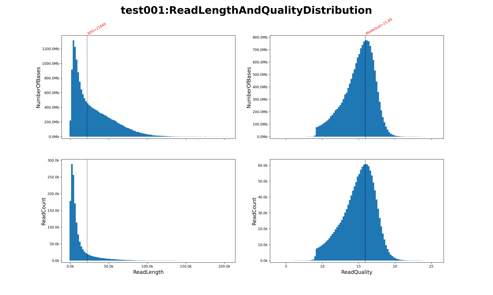

   # nanofq
   
   A simple Rust program designed for processing nanopore long reads, providing functionalities such as **statistics (stats)**, **filtering (filter)**, **extracting subsequences (subseq)** and **generating draft consensus sequences from amplicon reads**. 
   ## Installation
   
   To get started with `nanofq`, follow the steps below. Ensure you have Cargo version 1.85.0 or higher installed.
   
   ```bash
   git clone https://github.com/aadali/nanofq
   cd nanofq
   cargo build --release 
   ```
   Then you can find `nanofq` in `./target/release`
   > Note: For generating statistical plots, `python3` along with the `matplotlib` library is required.
   
   ## Usage
   
   ```
   A simple program for nanopore long reads to stats, generate draft consensus from amplicons, filter, subseq...
   
   Usage: nanofq [COMMAND]
   
   Commands:
     stats     stats nanopore reads, output stats result, summary and optional figures
     amplicon  generate draft consensus sequences from mixed nanopore Ligation-based amplicons reads with known (provided via --primers) or unknown primers
     filter    filter nanopore reads by length, quality or optional gc content
     subseq    extract specified reads (by name, name list or region) from a fastq[.gz] or indexed bam file
     help      Print this message or the help of the given subcommand(s)
   ```
   
   ### stats
   
   ```
   stats nanopore reads, output stats result, summary and optional figures

Usage: nanofq stats [OPTIONS] --input <input>

Options:
  -i, --input <input>        the input file, could be
                                 1. a single fastq[.gz]
                                 2. a directory containing some fastq[.gz]
                                 3. a bam or sam file
  -o, --output <output>      output the stats result into this tsv file if specified. it will be truncated if it exists
  -s, --summary <summary>    output stats summary into this file, it will be truncated if it exists [default: ./NanofqStatsSummary.txt]
  -n, --topn <topn>          write the top N longest reads and highest quality reads info into summary file [default: 5]
  -u, --use_dorado_q         use dorado q-score calculation. this means the leading 60 bases will be trimmed if the read length is longer than 60 when calculating the read Q-value
  -q, --quality <quality>    count the reads whose quality is greater than this value, multiple values can be separated by comma [default: 25,20,18,15,12,10]
  -l, --length <length>      count reads whose length is greater than this value if you set this parameter, multiple values can be separated by comma
      --gc                   whether to calculate the GC content [default: false]
  -I, --index                build index firstly for sorted but unindexed bam file [default: false]
  -t, --thread <thread>      number of threads [default: 1]
  -c, --chunk <chunk>        reads chunk size when multi threads used [default: 50000]
      --python <python>      python3 path, matplotlib will be imported [default: python3]
  -p, --plot <plot>          whether to make plot, if set, it should be the prefix of figure path without filename extension
  -f, --format <format>      which format figure do you want if --plot is set, this parameter can be set multi times [default: pdf] [possible values: png, pdf, jpg, svg]
      --quantile <quantile>  the top and bottom quantile of reads lengths will be excluded from the plot [default: 0.01]
   stats nanopore reads, output stats result, summary and optional figures
```
The program processes all input fastqs and outputs the statistical results to the specified `--output` file and a summary to the `--summary` file. If the `--plot` option is enabled, it also generates visualizations similar to the following:



#### stats examples
```bash
nanofq stats -i test.fastq -o test001.stats.tsv -s test001.summary.txt -t 4 --plot ./test001 -f pdf -f png -f svg
# with 4 threads,
# stats test.fastq in current dir, 
# output stats result: test001.stats.tsv and summary file: test001.summary.txt 
# generate plot, ./test001.pdf, ./test001.png, ./test001.svg

nanofq stats -i ./fastqs_directory -n 10 --gc -l 1000,10000,50000,100000
# stats all fastq file in directory ./fastqs_directory
# output top 10 longest reads and highest quality reads in summary
# stats gc content
# output reads stats infomation whose length is greater than 1k,10k,50k,100k in default summary file ./NanofqStatsSummary.txt
```
### amplicon
```aiignore
generate draft consensus sequences from mixed nanopore Ligation-based amplicons reads with known (provided via --primers) or unknown primers

Usage: nanofq amplicon [OPTIONS] --input <input> --output <output>

Options:
  -i, --input <input>                                      the input fastq[.gz] file
  -o, --output <output>                                    output directory for results
  -p, --primers <primers>                                  known primers. format: "PrimerName,FwdPrimer,RevPrimer[;...]" or a file with each line format: PrimerName\tFwdPrimer\tRevPrimer
  -n, --number <number>                                    number of amplicons mixed in the sample when no known primers provided [default: 1]
  -b, --barcode <barcode>                                  barcode index (0-96). 0 means no barcode is used [default: 0]
  -l, --left <left>                                        first N bases of read used for barcode/primer detection [default: 150]
  -r, --right <right>                                      last N bases of read used for barcode/primer detection [default: 150]
  -d, --distance <distance>                                min edit distance allowed between barcode/primer and read sequence [default: 3]
      --downsample <downsample>                            max number of reads with paired primers used to build consensus [default: 5000]
      --min_qual <min_qual>                                min read quality that with paired primers at dual reads [default: 15]
      --len_range <len_range>                              allowed reads length with paired primers from mean length. e.g., 0.05 = ±5% [default: 0.05]
      --prefix <prefix>                                    the prefix of output files  [default: test001]
      --retain_failed                                      whether to save reads with paired primers but failing quality/length filters
      --lead <lead>                                        [unknown primers mode]: use first N bases as candidate forward primer after barcode trimmed [default: 21]
      --detect_rev_primer_reads <detect_rev_primer_reads>  [unknown primers mode]: number of reads used to detect reverse primer [default: 500]
      --min_mapq <min_mapq>                                [unknown primers mode]: min MAPQ used to collect reads that with no paired primers detected but can be mapped to draft consensus [default: 50]
      --minimap2 <minimap2>                                [unknown primers mode]: minimap2 path [default: minimap2]
      --samtools <samtools>                                [unknown primers mode]: samtools path [default: samtools]
      --abpoa <abpoa>                                      abpoa path [default: abpoa]
  -t, --thread <thread>                                    number of threads [default: 4]
  -h, --help                                               Print help
```
The `amplicon` subcommand is used to generated draft consensus from Nanopore Ligation-based long amplicons reads. Firstly all reads will be adapter/barcode trimmed and collected. Then it can be run in two mode to classify reads by primers:
1) Known Primers: When known primers is provided by `--primers` parameter, program will detect primers at dual ends of each read. If forward primer and reverse primer can be detected simultaneously, these reads are called paired‑primer reads. For each paired primers in `--primers`, some paired-primers reads collected, drop some paired-primers-reads depending on `--min-qual` and `len_range`, save them in `*.bad.fastq` if `--retain_failed` is set. Up to `--downsample` reads whose length are closest to mean_length are selected and saved in `*.good.fastq`. The remaining paired-primers reads are saved in `*.redundant.fastq`. The `*.good.fasq` file is used to construct draft consensus.
2) Unknown primers: 
   1. Theoretically, after adapter/brcode trimming, the read should start with forward or reverse primer (each strand of DNA may be sequenced). 
   2. So the first N (`--lead`) bases of reads are used as candidate primers. Calculate the frequency of all lead sequences and sort them in descending order by frequency. 
   3. Use the most frequency lead sequence as candidate forward primer (fwd_primer), then search for the reverse complementary of other lead_seqs (called by rev_primer) at 3'end of all reads that starts with fwd_primer. If many reverse complementary of rev_primer can be found, a paired primers is considered found.
   4. The paired primers discovered in the previous step are used to search all reads and classify these paired‑primer reads. Then drop some paired‑primer reads based on `--min_qual` and `--len_range` (save them in *.bad.fastq if `--retain_failed`). Select up to `--downsample` reads whose lengths are closest to the mean length and save them in `*.good.fastq`. Other paired‑primer reads go to `*.redundant.fastq`. The `*.good.fastq` is used to build the draft consensus.
   5. The remaining reads that do not have paired primers are mapped to the previous draft consensus. Select alignments with `--min_mapq` and remove them from the remaining reads.
   6. Proceed to the next iteration to detect the next paired primers until all `--number` amplicons are finished.
#### `amplicon` examples
```aiignore
nanofq amplicon -i amplicons.fatq -o ./known_primers_output -p known_primers.tsv --barcode 1 
# known primers mode
# barcode1 sequence of NBD114.24 used to trimmed barcode in reads
# try to generated N amplicons' draft consensus. N is equal the primers numbers in known_primers.txv

nanofq amplicon -i amplicons.fastq -o ./unknown_primers_output -n 10 --barcode 1
# unknown primers mode, cause no known primers specified by `--primers`
# barcode1 sequence of NBD114.24 used to trimmed barcode in reads
# try to generated N amplicons' draft consensus. The number of amplicons mixed in this sample should be specified by `--number` 
```

#### amplicon outputs
* `*detected_primers.tsv` detected primers in unknown primers mode
* `*clean.fastq` adapter/barcode trimmed fastq
* `*primer1.with_paired_primers.bad.fastq` reads with paired primers detected at dual ends but failing quality/length filters
* `*primer1.with_paired_primers.good.fastq` reads with paired primers and passing qulality/length filters, selected up to `--downsample` reads whose length are closest to the mean length
* `*primer1.with_paired_primers.redundant.fastq` reads with paired primers that are neither good nor bad
* `*primer1.remaining.fastq` all reads except those with paired primers for primer1. Some reads from primer1 that lack paired primers may be in this file. These reads will be selected by map them to draft_consensus. In reads in `*.primer2.remaining.fastq`, reads from primer1 and those with paired primer2 have been excluded. and so on...
* `*primer1.draft_consensus.fastq` draft consensus amplicon from primer1
* `*primer1.log` abpoa log 
* `*primer1.sorted.bam` map `primer1.remaining.fastq` to `*primer1.draft_consensus.fastq`
#### amplicon notes and limits
* If possible, always specify primers by `--primer`
* As described above, in known primers mode, draft consensus sequences for amplicons can be generated in parallel and with high efficiency. In contrast, under the unknown primers mode, consensus sequences must be construct one by one, resulting in significantly lower throughput. Consequently, the known primer mode is much faster than unknown primer mode.
* Non-specific amplification can have a more negative effect when primers are positioned inappropriately. The more specific the amplicon, the better.
* It is not recommended to run unknown primers mode when multiple amplicons share the same forward primer but have different reverse primers.
* Only one draft consensus will be generated even if amplicons come from a heterozygous diploid. You will see some heterozygous sites in IGV.
#### amplicon dependency
* [minimap2](https://github.com/lh3/minimap2) in unknown primers mode
* [samtools](https://github.com/samtools/samtools) in unknown primers mode
* [abpoa](https://github.com/yangao07/abpoa)

### subseq
```
extract specified reads (by name, name list or region) from a fastq[.gz] or indexed bam file

Usage: nanofq subseq [OPTIONS] --input <input>

Options:
  -i, --input <input>            a fastq[.gz] or indexed bam file used to extract sub fastq records
  -o, --output <output>          the path of output uncompressed fastq file
  -n, --names <names>            comma-separated list of reads names to extract. e.g., --names ReadName1,ReadName2,ReadName2
  -N, --names_file <names_file>  read names list file, one name per line
  -r, --region <region>          region in indexed bam. format: Contig:Start-End, 0-based half-open intervals, multi regions can be separated by comma. e.g., --region: chr1:100-200,chr2:300-400
  -L, --bed <bed>                bed file of interested region, the first 3 columns needed
  -h, --help                     Print help
```
The `subseq` subcommand is used to extract specified read records from a FASTQ[.gz] or indexed BAM file
* Input must be a FASTQ or indexed BAM file.
* If --output is specified, the output will be written to the specified file; otherwise, it will be sent to standard output.
* For FASTQ input, either --names or --names_file must be provided, but not both.
* For indexed BAM files, one of --names, --names_file, --region, or --bed must be specified to indicate the reads to extract, but only one of these options can be used.

#### subseq examples
```aiignore
nanofq subseq -i sample.fastq.gz -n read1,read2,read3
# Extract specific reads from a FASTQ file and output to stdout

nanofq subseq -i sample.bam -r chr1:1000-2000 -o extracted_reads.fastq
# Extract reads based on a region from an indexed BAM file and save the result to a new file

nanofq subseq -i sample.bam -L regions.bed -o extracted_from_bed.fastq
# Extract reads from an indexed BAM file using regions defined in a BED file
```

### filter
```
filter nanopore reads by length, quality or optional gc content

Usage: nanofq filter [OPTIONS] --input <input>

Options:
  -i, --input <input>                  the input fastq, a fastq[.gz] or a directory containing some fastq[.gz]
  -o, --output <output>                output the filtered fastq into this file, it will be truncated if it exists. Compressed file is not supported
  -l, --min_len <min_len>              min read length [default: 1]
  -L, --max_len <max_len>              max read length [default: 4294967295]
  -q, --min_qual <min_qual>            min read quality [default: 7.0]
  -Q, --max_qual <max_qual>            max read quality, usually, you don't need to change this [default: 50.0]
  -u, --use_dorado_q                   use Dorado Q-score calculation: trim leading 60 bases if read length > 60 before calculate read quality
      --gc                             whether gc content is used to filter read
  -g, --min_gc <min_gc>                min gc content when --gc is set [default: 0.0]
  -G, --max_gc <max_gc>                max gc content when --gc is set [default: 1.0]
  -t, --thread <thread>                number of threads [default: 1]
  -c, --chunk <chunk>                  reads chunk size when multi threads used [default: 50000]
      --retain_failed <retain_failed>  whether to save the failed records, if set, it should be path of failed fastq
  -h, --help                           Print help
```


## ChangeLog
### nanofq (V0.4.0) 2026-6-4
1. refactor stats, subseq, filter subcommands, use [needletail](https://docs.rs/needletail/latest/needletail/) to read fastq file
2. now amplicon can be used to generate multiple draft consensus from mixed nanopore ligation-based amplicons reads with known or unknown reads
3. remove trim subcommand, use dorado trim
4. fix some bugs
### nanofq (V0.3.0) 2026-3-4
1. add `subseq` subcommand to extract sub Fastq Records from fastq[.gz] or indexed bam

### nanofq (v0.2.2) 2025-12-18
1. change mean_read_quality to sum(read_quality) / reads_number just like [fastcat](https://github.com/epi2me-labs/fastcat)

### nanofq (v0.2.1) 2025-11-29
1. multi threads supported to stats bam/ubam/sam from file or stdin.

### nanofq (v0.2.0) 2025-11-26
1. bam/sam format supported for `stats` subcommand

### nanofq (v0.1.3) 2025-11-20
1. change --use_dorado_quality parameter in filter and stats subcommands to --dont_use_dorado_quality and its logic

### nanofq (v0.1.2) 2025-11-18
1. add --range parameter for amplicon subcommand
2. remove find mode in amplicon subcommand, always use local alignment to find primers of amplicon

### nanofq (v0.1.1) 2025-11-12
1. add --use_dorado_quality parameter for stats and filter subcommands. Dorado [trim the leading 60 bases](https://software-docs.nanoporetech.com/dorado/latest/basecaller/qscore/#mean-q-score-calculation-in-dorado) if the sequence is longer than 60 bases when calculates read Q-score
2. fix bug that meta info reserved in read name of stats output for dorado post basecalled fastq cause dorado use tab to sperate meta info of fastq record header